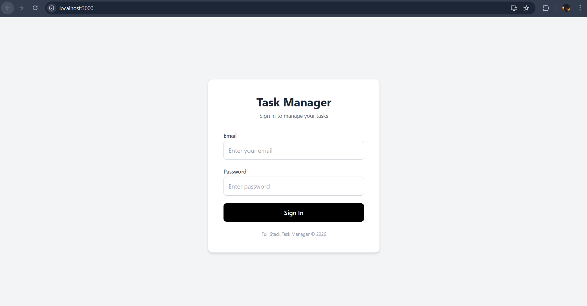
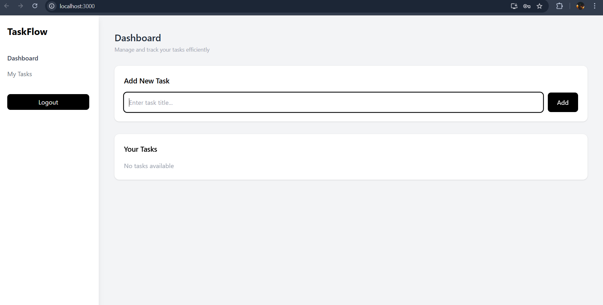
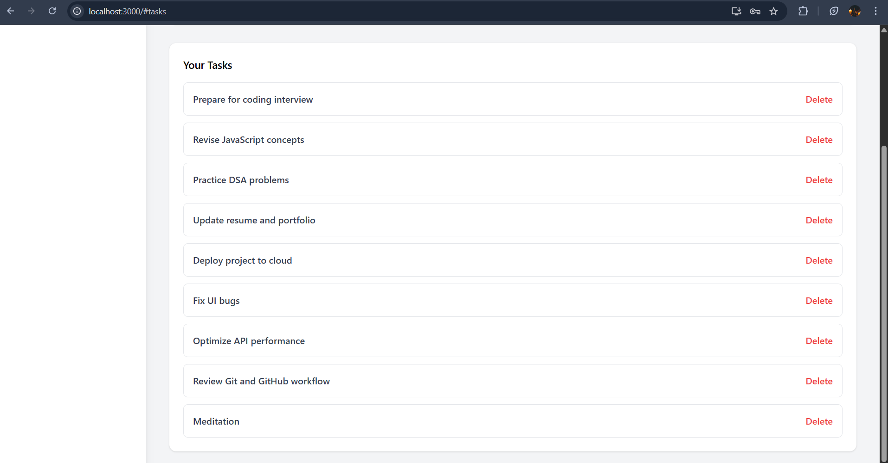

# 🚀 TaskFlow - Full Stack Task Management System

A professional full-stack task management web application that allows users to securely manage daily tasks through a clean and responsive dashboard.

This project demonstrates complete frontend–backend integration, REST API design, authentication, and Docker-based database setup.

---

# 🧠 Project Overview
TaskFlow is a full-stack productivity web application where users can:

- Securely login using JWT authentication  
- Create and manage daily tasks  
- Delete tasks instantly  
- View tasks in a structured dashboard  
- Store data in MongoDB using Docker  

This project highlights system design, API integration, and full-stack development skills.

---

# 🏗 System Architecture

```
React Frontend (Tailwind UI)
        ↓ API Calls
Node.js + Express Backend
        ↓
MongoDB (Docker Container)
```

---

# 💻 Tech Stack

### Frontend
- React.js  
- Tailwind CSS  
- Axios  

### Backend
- Node.js  
- Express.js  
- JWT Authentication  
- REST APIs  

### Database
- MongoDB  
- Docker containerized database  

---

# 🔐 Features
✔ Secure login with JWT authentication  
✔ Protected API routes  
✔ Create tasks  
✔ Delete tasks  
✔ Persistent database storage  
✔ Clean professional dashboard UI  
✔ Docker-based MongoDB setup  
✔ Full frontend-backend integration  

---

# 🔗 API Endpoints

## Authentication APIs
- **POST** `/api/auth/register` → Register user  
- **POST** `/api/auth/login` → Login & get token  

## Task APIs (Protected)
- **GET** `/api/tasks` → Get all tasks  
- **POST** `/api/tasks` → Create new task  
- **PUT** `/api/tasks/:id` → Update task  
- **DELETE** `/api/tasks/:id` → Delete task  

Authentication: JWT token required in headers.

---

# 🗄 Database Schema

## User Collection
- name : String  
- email : String (unique)  
- password : String (hashed)  

## Task Collection
- user : ObjectId (reference to user)  
- title : String  
- status : pending/completed  
- createdAt : Date  

Database: MongoDB running in Docker container.

---

# ⚙️ Installation & Setup

## 1️⃣ Clone repository
```bash
git clone https://github.com/Tejaswini-628/Cerevyn-fullstack.git
cd Cerevyn-fullstack
```

## 2️⃣ Backend setup
```bash
cd backend
npm install
npm run dev
```

## 3️⃣ Frontend setup
```bash
cd frontend
npm install
npm start
```

## 4️⃣ Run MongoDB Docker
```bash
docker compose up -d
```

---

# 📸 Screenshots
(Add your screenshots here)

### Login Page


### Dashboard


### Tasks List


---
